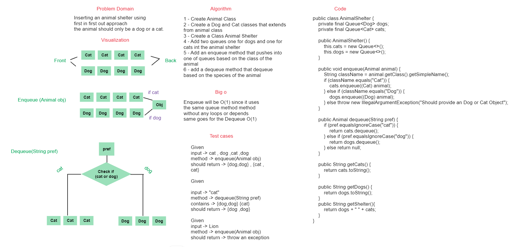

## Animal Shelter

### Summary

to implement an animal shelter using fifo approach

### WhiteBoard



### Approach & Efficiency

The approach used in this to make 2 Queues one queue is for dogs object and 
the another is for cats objects.
now to enqueue into the animalshelter we need to check the class type of
the inserted animal if dog added it to the dog queue and the same goes for cats

### Big O

enqueue method takes the same as the queue time complexity which is O(1) and the
same goes for the dequeue O(1)

## Solution

### Code

```java
public class AnimalShelter {
    private final Queue<Dog> dogs;
    private final Queue<Cat> cats;

    public AnimalShelter() {
        this.cats = new Queue<>();
        this.dogs = new Queue<>();
    }

    public void enqueue(Animal animal) {
        String className = animal.getClass().getSimpleName();
        if (className.equals("Cat")) {
            cats.enqueue((Cat) animal);
        } else if (className.equals("Dog")) {
            dogs.enqueue((Dog) animal);
        } else throw new IllegalArgumentException("Should provide an Dog or Cat Object");
    }

    public Animal dequeue(String pref) {
        if (pref.equalsIgnoreCase("cat")) {
            return cats.dequeue();
        } else if (pref.equalsIgnoreCase("dog")) {
            return dogs.dequeue();
        } else return null;
    }

    public String getCats() {
        return cats.toString();
    }

    public String getDogs() {
        return dogs.toString();
    }
    public String getShelter(){
        return dogs + " " + cats;
    }
}
```
code -> [code](./app/src/main/java/stack/queue/anmials/AnimalShelter.java)
### Test

```java
@Test
public void catClassTest() {
        Cat cat = new Cat("cat1");
        Animal animalCat = new Cat("cat2");

        assertEquals( "cat1", cat.getName());
        assertEquals( "Cat", animalCat.getClass().getSimpleName());
        }
@Test
public void dogClassTest() {
        Dog dog = new Dog("dog1");
        Animal animalDog = new Dog("dog2");

        assertEquals( "dog1", dog.getName());
        assertEquals( "Dog", animalDog.getClass().getSimpleName());
        }

@Test
public void enqueueTest() {
        AnimalShelter shelter = new AnimalShelter();

        shelter.enqueue(new Cat("cat1"));
        shelter.enqueue(new Dog("dog1"));
        shelter.enqueue(new Cat("cat2"));

        assertEquals( "front -> { Cat -> { Name : cat1, Species : Cat } } -> { Cat -> { Name : cat2, Species : Cat } } <- rear", shelter.getCats());
        assertEquals( "front -> { Dog -> { Name : dog1, Species : Dog } } <- rear", shelter.getDogs());
        }

@Test
public void dequeueTest() {
        AnimalShelter shelter = new AnimalShelter();

        shelter.enqueue(new Cat("cat1"));
        shelter.enqueue(new Dog("dog1"));
        shelter.enqueue(new Cat("cat2"));
        shelter.dequeue("cat");
        shelter.dequeue("dog");
        assertEquals( "front -> { Cat -> { Name : cat2, Species : Cat } } <- rear", shelter.getCats());
        assertNull( shelter.dequeue("bird"));
        assertEquals( "front -> rear", shelter.getDogs());
        assertEquals( "front -> { Cat -> { Name : cat2, Species : Cat } } <- rear", shelter.getCats());
        }
```
Test -> [Test](./app/src/test/java/stack/queue/AnimalShelterTest.java)
