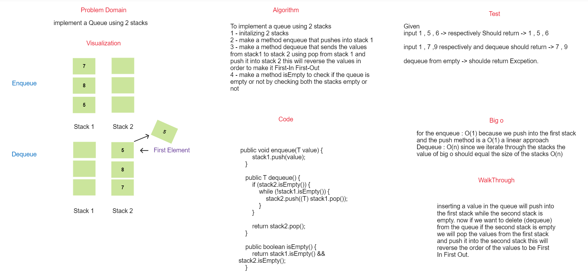

## Pseduo Queue

### Summary

 to make a queue using two stacks we need to make the first stack as a enqueue method and the second stack as a dequeue method
 
by making  this we will accomplish the FIFO that queue uses.

### WhiteBoard



### Approach & Efficiency

The approach used in this to make The first stack acts like the enqueue method and push inside it
and making the second stack act like the dequeue method.

on dequeue the values from the first stack will be popped and pushed inside the second stack
this will allow us to make the FIFO principle for the queue.

### Big O

For the enqueue O(1) , Dequeue O(n).

## Solution

### Code

```java
public PseudoQueue() {
        this.stack1 = new Stack<>();
        this.stack2 = new Stack<>();
    }

    public void enqueue(T value) {
        stack1.push(value);
    }

    public T dequeue() {
        if (stack2.isEmpty()) {
            while (!stack1.isEmpty()) {
                stack2.push((T) stack1.pop());
            }
        }

        return stack2.pop();
    }

    public boolean isEmpty() {
        return stack1.isEmpty() && stack2.isEmpty();
    }
```
code -> [code](./app/src/main/java/stack/queue/queue/PseudoQueue.java)
### Test

```java
@Test
    public void enqueueIntoQueue_And_ReturnValues() throws Exception {
        PseudoQueue<Integer> queue = new PseudoQueue<>();
        assertTrue(queue.isEmpty());

        queue.enqueue(1);
        queue.enqueue(2);
        queue.enqueue(3);

        assertFalse(queue.isEmpty());
        assertEquals(1, queue.dequeue());
        assertEquals(2, queue.dequeue());
        assertEquals(3, queue.dequeue());

        assertTrue(queue.isEmpty());
    }

    @Test
    public void whenEmptyQueue_ReturnException() {
        PseudoQueue<Integer> queue = new PseudoQueue<>();
        assertTrue(queue.isEmpty());

        assertThrows(Exception.class, queue::dequeue);
    }

    @Test
    public void givenAQueue_ReturnToString() throws Exception {
        PseudoQueue<Integer> queue = new PseudoQueue<>();
        assertTrue(queue.isEmpty());

        queue.enqueue(1);
        queue.enqueue(2);
        queue.enqueue(3);
//        queue.dequeue();
        String expected = "FRONT -> { 1 } -> { 2 } -> { 3 } -> REAR";
        assertEquals(expected, queue.toString());

    }
    @Test
    void givenAQueue_DequeueReturnValues(){
        PseudoQueue<Integer> queue = new PseudoQueue<>();
        queue.enqueue(4);
        queue.enqueue(45);
        queue.enqueue(15);
        queue.dequeue();
        assertEquals("FRONT -> { 45 } -> { 15 } -> REAR",queue.toString());
    }
```
Test -> [Test](./app/src/test/java/stack/queue/PseudoQueueTest.java)
