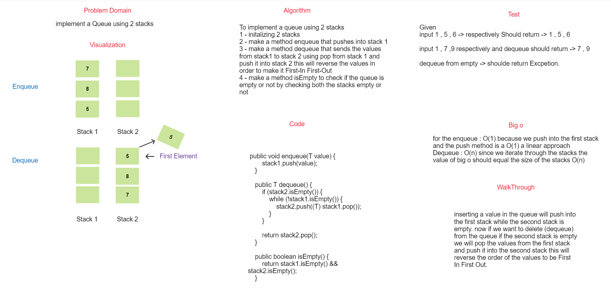
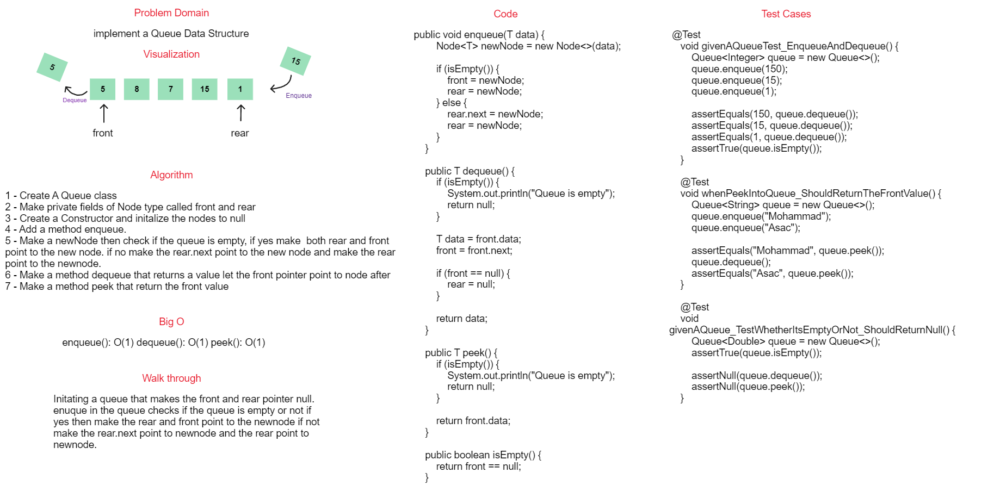

## Stack

### Summary

A **stack** is a linear data structure that follows the Last-In-First-Out (LIFO) principle. In a stack, elements are added and removed from the same end, which is typically referred to as the "top" of the stack. The most recently added item is the first one to be removed. Common operations for a stack include:

- **Push**: Adding an element to the top of the stack.
- **Pop**: Removing and returning the element at the top of the stack.
- **Peek**: Viewing the element at the top of the stack without removing it.
- **isEmpty**: Checking if the stack is empty.

### WhiteBoard



#### Approach & Efficiency

push(value):

1. Create a new Node with the specified value.
    - Set the next pointer of the new Node to the current top of the stack.
    - Set the top of the stack to the new Node.
2. pop():

    - Check if the stack is empty. If it is, raise an exception.
    - Get the value of the Node at the top of the stack.
    - Set the top of the stack to the next Node.
    - Return the value of the Node.
3. peek():

    - Check if the stack is empty. If it is, raise an exception.
    - Return the value of the Node at the top of the stack.
    - is_empty():
    - Check if the top of the stack is None. If it is, return True. Otherwise, return False.

#### Big o
The big o notation for the stack :
pop() : O(1) , push : O(1) , peek O(1)

### Solution

#### Code 

```java
public void push(T data) {
        Node<T> newNode = new Node<>(data);
        newNode.next = top;
        top = newNode;
    }

    public T pop() {
        if (isEmpty()) {
            System.out.println("Stack is empty");
            return  null;
        }

        T data = top.data;
        top = top.next;
        return data;
    }

    public T peek() {
        if (isEmpty()) {
            System.out.println("Stack is empty");
            return null;
        }

        return top.data;
    }

    public boolean isEmpty() {
        return top == null;
    }
```

#### Test
```java
@Test
    void givenStackTestWhetherItPopsOrPush() {
        Stack<Integer> stack = new Stack<>();
        stack.push(150);
        stack.push(15);
        stack.push(1);

        assertEquals(1, stack.pop());
        assertEquals(15, stack.pop());
        assertEquals(150, stack.pop());
        assertTrue(stack.isEmpty());
    }

    @Test
    void whenPeekIntoStack_ShouldReturnTheTopValue() {
        Stack<String> stack = new Stack<>();
        stack.push("Mohammad");
        stack.push("Asac");

        assertEquals("Asac", stack.peek());
        assertEquals("Asac", stack.peek());
        stack.pop();
        assertEquals("Mohammad", stack.peek());
    }

    @Test
    void givenEmptyStack_ShouldReturnNull() {
        Stack<Double> stack = new Stack<>();
        assertTrue(stack.isEmpty());

        assertNull(stack.pop());
        assertNull(stack.peek());
    }
```

code -> [code](./app/src/main/java/stack/queue/stack/Stack.java)

---

## Queue

### Summary

A **queue** is a linear data structure that follows the First-In-First-Out (FIFO) principle. In a queue, elements are added at one end (the "rear" or "enqueue" end) and removed from the other end (the "front" or "dequeue" end). The first element added to the queue is the first one to be removed. Common operations for a queue include:

- **Enqueue**: Adding an element to the rear of the queue.
- **Dequeue**: Removing and returning the element at the front of the queue.
- **Peek**: Viewing the element at the front of the queue without removing it.
- **isEmpty**: Checking if the queue is empty.

### WhiteBoard



#### Approach & Efficiency

- enqueue(value):

1. Create a new Node with the specified value.
2. If the queue is empty, set both the front and the rear of the queue to the new Node.
3. Otherwise, set the next pointer of the current rear of the queue to the new Node, and set the rear of the queue to the new Node.

- dequeue():

1. Check if the queue is empty. If it is, raise an exception.
2. Get the value of the Node at the front of the queue.
3. Set the front of the queue to the next Node.
4. If the front of the queue is now None, set the rear of the queue to None as well.
5. Return the value of the Node.

- peek():

1. Check if the queue is empty. If it is, raise an exception.
2. Return the value of the Node at the front of the queue.

- is_empty():

1. Check if the front of the queue is None. If it is, return True. Otherwise, return False.

#### Big o

The big o notation for the Queue :
enqueue(): O(1) dequeue(): O(1) peek(): O(1)

### Solution

#### Code

```java
public void enqueue(T data) {
        Node<T> newNode = new Node<>(data);

        if (isEmpty()) {
            front = newNode;
            rear = newNode;
        } else {
            rear.next = newNode;
            rear = newNode;
        }
    }

    public T dequeue() {
        if (isEmpty()) {
            System.out.println("Queue is empty");
            return null;
        }

        T data = front.data;
        front = front.next;

        if (front == null) {
            rear = null;
        }

        return data;
    }

    public T peek() {
        if (isEmpty()) {
            System.out.println("Queue is empty");
            return null;
        }

        return front.data;
    }

    public boolean isEmpty() {
        return front == null;
    }
```

#### Test

```java
@Test
    void givenAQueueTest_EnqueueAndDequeue() {
        Queue<Integer> queue = new Queue<>();
        queue.enqueue(150);
        queue.enqueue(15);
        queue.enqueue(1);

        assertEquals(150, queue.dequeue());
        assertEquals(15, queue.dequeue());
        assertEquals(1, queue.dequeue());
        assertTrue(queue.isEmpty());
    }

    @Test
    void whenPeekIntoQueue_ShouldReturnTheFrontValue() {
        Queue<String> queue = new Queue<>();
        queue.enqueue("Mohammad");
        queue.enqueue("Asac");

        assertEquals("Mohammad", queue.peek());
        queue.dequeue();
        assertEquals("Asac", queue.peek());
    }

    @Test
    void givenAQueue_TestWhetherItsEmptyOrNot_ShouldReturnNull() {
        Queue<Double> queue = new Queue<>();
        assertTrue(queue.isEmpty());

        assertNull(queue.dequeue());
        assertNull(queue.peek());
    }
```

code -> [code](./app/src/main/java/stack/queue/queue/Queue.java)
