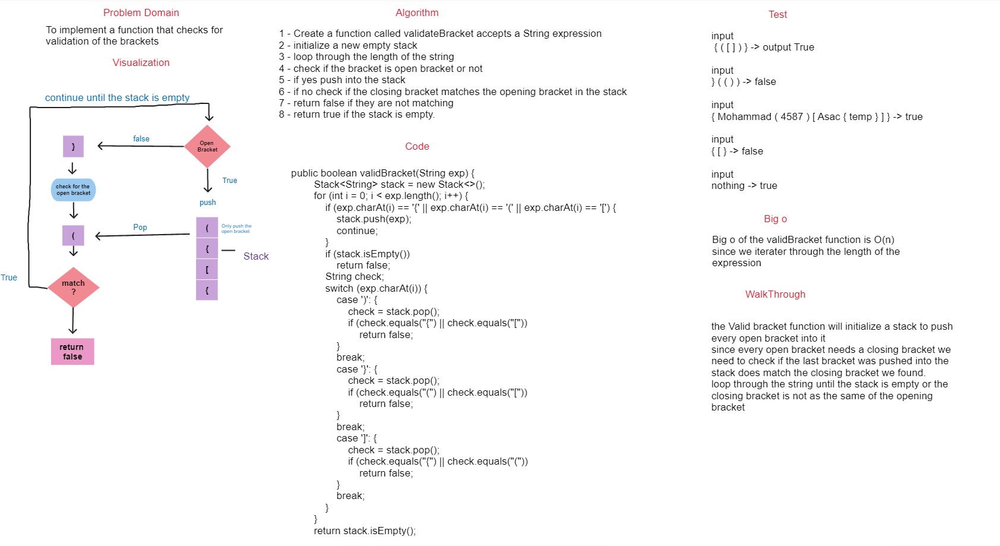

## Valid Bracket

### Summary

implementing a valid bracket to check the balance of the brackets

### WhiteBoard



### Approach & Efficiency

The approach used in this is to make a stack that only push the opening brackets and check the closing bracket if it matches the last opening bracket in the stack if yes it will continue until the stack is empty if no it will return with false.

### Big O

Big o of the validBracket function is O(n) since we iterate through the length of the expression

## Solution

### Code

```java
public boolean validBracket(String exp) {
        Stack<String> stack = new Stack<>();
        for (int i = 0; i < exp.length(); i++) {
            if (exp.charAt(i) == '{' || exp.charAt(i) == '(' || exp.charAt(i) == '[') {
                stack.push(exp);
                continue;
            }
            if (stack.isEmpty())
                return false;
            String check;
            switch (exp.charAt(i)) {
                case ')': {
                    check = stack.pop();
                    if (check.equals("{") || check.equals("["))
                        return false;
                }
                break;
                case '}': {
                    check = stack.pop();
                    if (check.equals("(") || check.equals("["))
                        return false;
                }
                break;
                case ']': {
                    check = stack.pop();
                    if (check.equals("{") || check.equals("("))
                        return false;
                }
                break;
            }
        }
        return stack.isEmpty();
    }
```

code -> [code](./app/src/main/java/stack/queue/stack/ValidBracket.java)

### Test

```java
public class ValidBracketTest {
    @Test
    public void givenEmptyString_Bracket_ShouldReturnTrue(){
        ValidBracket v = new ValidBracket();
        assertTrue(v.validBracket(""));
    }
    @Test
    public void givenString_With_StartingOpenBracket_ShouldReturnFalse(){
        ValidBracket v = new ValidBracket();
        assertFalse(v.validBracket("}(())"));
    }
    @Test
    public void givenStringWith_MixedDataAndCorrectBrackets_ShouldReturnTrue(){
        ValidBracket v = new ValidBracket();
        assertTrue(v.validBracket("{Mohammad(4587)[Asac{temp}]}"));
    }
    @Test
    public void givenStringWith_MissingClosingBracket_ShouldReturnFalse(){
        ValidBracket v =new ValidBracket();
        assertFalse(v.validBracket("{[}"));
    }
}
```

Test -> [Test](./app/src/test/java/stack/queue/ValidBracketTest.java)
