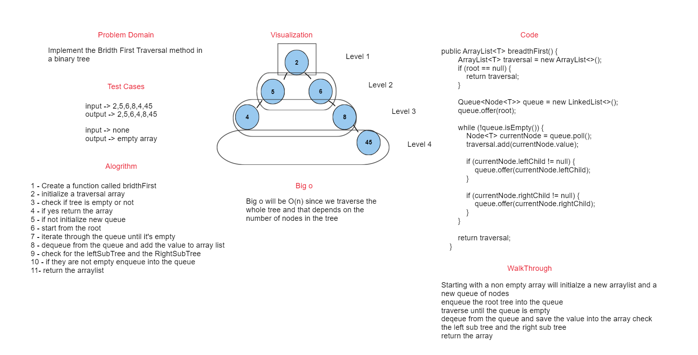

# Breadth First Search

## Summary

an implementation of breadth first search in binary tree
## WhiteBoard



## Approach & Efficiency
Starting with a non empty array will initialize a new arraylist and a new queue of nodes
enqueue the root tree into the queue
traverse until the queue is empty
dequeue from the queue and save the value into the array check the left sub tree and the right sub tree
return the array
## Big O
Big o will be O(n) since we traverse the whole tree and that depends on the number of nodes in the tree


## Solution

### Code
```java
public ArrayList<T> breadthFirst() {
        ArrayList<T> traversal = new ArrayList<>();
        if (root == null) {
        return traversal;
        }

        Queue<Node<T>> queue = new LinkedList<>();
        queue.offer(root);

        while (!queue.isEmpty()) {
        Node<T> currentNode = queue.poll();
        traversal.add(currentNode.value);

        if (currentNode.leftChild != null) {
        queue.offer(currentNode.leftChild);
        }

        if (currentNode.rightChild != null) {
        queue.offer(currentNode.rightChild);
        }
        }

        return traversal;
        }
```

### Test

```java
@Test
public void givenATree_TraversUsingBFS(){
        BinarySearchTree<Integer> bst = new BinarySearchTree<>();
        bst.add(45); // root lvl 1
        bst.add(235); //right child of 45 lvl 2
        bst.add(5); // left child of 45 lvl 2
        bst.add(40); // right child of 5 lvl 3
        bst.add(89); // left child of 235 lvl 3
        bst.add(1234); // right child of 1234 lvl 3
        bst.add(0); // lef child of 5 lvl 3
        ArrayList<Integer> bstExpected = new ArrayList<>();
        bstExpected.add(45);
        bstExpected.add(5);
        bstExpected.add(235);
        bstExpected.add(0);
        bstExpected.add(40);
        bstExpected.add(89);
        bstExpected.add(1234);
        assertEquals(bstExpected, bst.breadthFirst());

        // Test when tree is empty
        BinarySearchTree<Integer> bst2 = new BinarySearchTree<>();
        bstExpected.clear();
        assertEquals(bstExpected, bst2.breadthFirst());
        }
```
