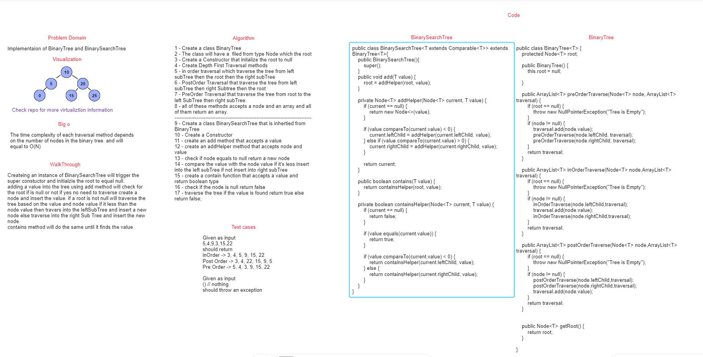
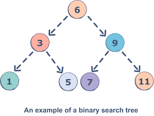
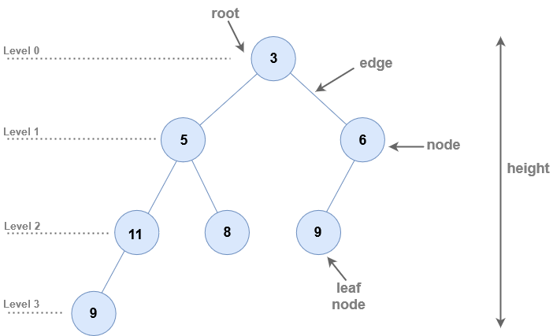

# Binary Tree && Binary Search Tree

## Summary

The `BinaryTree` class represents a binary tree data structure. It allows for the creation of a binary tree and provides methods for 
performing depth-first traversals: pre-order, in-order, and post-order.

The `BinarySearchTree` class is a subclass of the `BinaryTree` class and represents a binary search tree data structure. It inherits the basic functionality of a binary tree and provides additional methods for adding nodes and checking if a value exists in the tree.

## WhiteBoard



## More Visualizing




#### Approach & Efficiency

For the `Binary Tree` the approach used is to traverse the tree using Depth First Traversal method with it's imeplementations

1. **Pre-order traversal:** Visit the root, then traverse the left subtree, and finally traverse the right subtree.
2. **In-order traversal:** Traverse the left subtree, visit the root, and then traverse the right subtree.
3. **Post-order traversal:** Traverse the left subtree, traverse the right subtree, and finally visit the root.

The `BinarySearchTree` class adds the following methods to the `BinaryTree` class:

1. **add(value):** Adds a new node with the given value in the correct location in the binary search tree.
2. **contains(value):** Checks if the binary search tree contains a node with the given value.

The `add` method traverses the tree starting from the root and compares the value to be added with the values of the existing nodes to find the appropriate location. It recursively traverses the left or right subtree until it finds an empty spot for the new node.

The `contains` method also traverses the tree starting from the root. It compares the given value with the values of the existing nodes and recursively searches the left or right subtree until it finds the value or reaches a leaf node.


### Big O

**Binary Search Tree :**

The time complexity of the `add` method depends on the height of the binary search tree. In the best case, where the tree is balanced, the height is approximately log(n), where n is the number of nodes. In the worst case, where the tree is skewed, the height can be equal to the number of nodes `n`.

- **add:**  O(n)

The time complexity of the `contains` method is similar to the `add` method since it involves traversing the tree. It also depends on the height of the binary search tree.

- **contains:**  O(n)

**Binary Tree**

The space complexity of each traversal method depends on the height of the binary tree. In the worst case, where the binary tree is skewed, the height can be equal to the number of nodes `n`.

- **Pre-order traversal:** O(n)
- **In-order traversal:** O(n)
- **Post-order traversal:** O(n)

The space complexity is determined by the recursive calls made during the traversal, which can be as deep as the height of the tree.


## Solution

### Code

**BinaryTree**

```java
public class BinaryTree<T> {
    protected Node<T> root;

    public BinaryTree() {
        this.root = null;

    }

    public ArrayList<T> preOrderTraverse(Node<T> node, ArrayList<T> traversal) {
        if (root == null) {
            throw new NullPointerException("Tree is Empty");
        }
        if (node != null) {
            traversal.add(node.value);
            preOrderTraverse(node.leftChild, traversal);
            preOrderTraverse(node.rightChild, traversal);
        }
        return traversal;
    }

    public ArrayList<T> inOrderTraverse(Node<T> node,ArrayList<T> traversal) {
        if (root == null) {
            throw new NullPointerException("Tree is Empty");
        }
        if (node != null) {
            inOrderTraverse(node.leftChild,traversal);
            traversal.add(node.value);
            inOrderTraverse(node.rightChild,traversal);
        }
        return traversal;
    }

    public ArrayList<T> postOrderTraverse(Node<T> node,ArrayList<T> traversal) {
        if (root == null) {
            throw new NullPointerException("Tree is Empty");
        }
        if (node != null) {
            postOrderTraverse(node.leftChild,traversal);
            postOrderTraverse(node.rightChild,traversal);
            traversal.add(node.value);
        }
        return traversal;
    }


    public Node<T> getRoot() {
        return root;
    }

}
```

### Test 

```java
public class BinaryTreeTest {
    @Test
    public void givenEmptyTree_ShouldThrowAnException() {
        BinaryTree<Integer> bst = new BinaryTree<>();
        assertThrows(NullPointerException.class, () -> {
            bst.preOrderTraverse(bst.getRoot(), new ArrayList<>());
        });
        assertThrows(NullPointerException.class, () -> {
            bst.inOrderTraverse(bst.getRoot(), new ArrayList<>());
        });
        assertThrows(NullPointerException.class, () -> {
            bst.postOrderTraverse(bst.getRoot(), new ArrayList<>());
        });
    }

}
```

---

#### Binary Search Tree

#### Code

```java
public class BinarySearchTree<T extends Comparable<T>> extends BinaryTree<T>{
    public BinarySearchTree(){
        super();
    }
    public void add(T value) {
        root = addHelper(root, value);
    }

    private Node<T> addHelper(Node<T> current, T value) {
        if (current == null) {
            return new Node<>(value);
        }

        if (value.compareTo(current.value) < 0) {
            current.leftChild = addHelper(current.leftChild, value);
        } else if (value.compareTo(current.value) > 0) {
            current.rightChild = addHelper(current.rightChild, value);
        }

        return current;
    }

    public boolean contains(T value) {
        return containsHelper(root, value);
    }

    private boolean containsHelper(Node<T> current, T value) {
        if (current == null) {
            return false;
        }

        if (value.equals(current.value)) {
            return true;
        }

        if (value.compareTo(current.value) < 0) {
            return containsHelper(current.leftChild, value);
        } else {
            return containsHelper(current.rightChild, value);
        }
    }

}
```

#### Test

```java
public class BinarySearchTreeTest {
    @Test
    public void givenSingleNodeTree_ShouldReturnRoot(){
        BinarySearchTree<String> bst = new BinarySearchTree<>();
        bst.add("Mohammad");
        assertEquals("[Mohammad]",bst.preOrderTraverse(bst.getRoot(),new ArrayList<>()).toString());
        assertEquals("[Mohammad]",bst.postOrderTraverse(bst.getRoot(),new ArrayList<>()).toString());
        assertEquals("[Mohammad]",bst.inOrderTraverse(bst.getRoot(),new ArrayList<>()).toString());
    }
    @Test
    public void givenATree_ShouldReturnTraversalInCorrectOrder(){
        BinarySearchTree<Integer> bst = new BinarySearchTree<>();
        bst.add(15); // root
        bst.add(20); // right child
        bst.add(10); // left child
        bst.add(7); // left child of 10
        bst.add(12); // right child of 10
        bst.add(22); // right child of 20
        bst.add(17); // left child of 20
        bst.add(18); // right child of 17
        ArrayList<Integer> postOrderExpected = new ArrayList<>();
        postOrderExpected.add(7);
        postOrderExpected.add(12);
        postOrderExpected.add(10);
        postOrderExpected.add(18);
        postOrderExpected.add(17);
        postOrderExpected.add(22);
        postOrderExpected.add(20);
        postOrderExpected.add(15);
        assertArrayEquals(postOrderExpected.toArray(),bst.postOrderTraverse(bst.getRoot(),new ArrayList<>()).toArray());

        // In Order Traversal Test
        ArrayList<Integer> inOrderExpected = new ArrayList<>();
        inOrderExpected.add(7);
        inOrderExpected.add(10);
        inOrderExpected.add(12);
        inOrderExpected.add(15);
        inOrderExpected.add(17);
        inOrderExpected.add(18);
        inOrderExpected.add(20);
        inOrderExpected.add(22);
        assertArrayEquals(inOrderExpected.toArray(),bst.inOrderTraverse(bst.getRoot(),new ArrayList<>()).toArray());

        // Pre Order Traversal Test
        ArrayList<Integer> preOrderExpected = new ArrayList<>();
        preOrderExpected.add(15);
        preOrderExpected.add(10);
        preOrderExpected.add(7);
        preOrderExpected.add(12);
        preOrderExpected.add(20);
        preOrderExpected.add(17);
        preOrderExpected.add(18);
        preOrderExpected.add(22);
        assertArrayEquals(preOrderExpected.toArray(),bst.preOrderTraverse(bst.getRoot(),new ArrayList<>()).toArray());
    }
}

```
