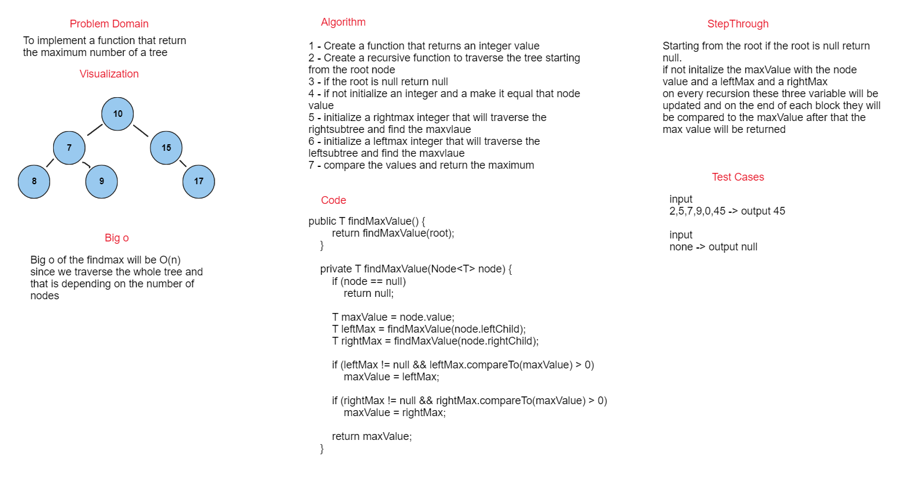

# Tree max

## Summary

an implementation of function findmax to find the maximum value of a binaryTree.

## WhiteBoard



## Approach & Efficiency

Initialize the `findMax` method and check if the root is null if yes return null. if not Initialize 3 variables the first one is `maxValue` that holdes the node value 
and a `leftMax , rightMax` variables that do the maxValue recursivley on each recursive the max value will be updated until we reach the end of the tree once we done each block of recursive will compare the maxValue with the updated one if it's bigger or not. finally we return the maxValue

## Big O

Big o of the findmax will be O(n) since we traverse the whole tree and that is depending on the number of  nodes

## Solution

### Code 
```java
public T findMaxValue() {
        return findMaxValue(root);
    }

    private T findMaxValue(Node<T> node) {
        if (node == null)
            return null;

        T maxValue = node.value;
        T leftMax = findMaxValue(node.leftChild);
        T rightMax = findMaxValue(node.rightChild);

        if (leftMax != null && leftMax.compareTo(maxValue) > 0)
            maxValue = leftMax;

        if (rightMax != null && rightMax.compareTo(maxValue) > 0)
            maxValue = rightMax;

        return maxValue;
    }
```

### Test

```java
@Test
    public void givenATree_WithNoNodes_findMaxShouldReturnNull(){
        BinarySearchTree<Integer> bst = new BinarySearchTree<>();
        assertNull(bst.findMaxValue());
    }
@Test
    public void givenATree_findMaxShouldReturnMaximum(){
        BinarySearchTree<Integer> bst = new BinarySearchTree<>();
        bst.add(45);
        bst.add(235);
        bst.add(5);
        bst.add(40);
        bst.add(89);
        bst.add(1234);
        bst.add(0);
        assertEquals(1234,bst.findMaxValue());
    }
```
