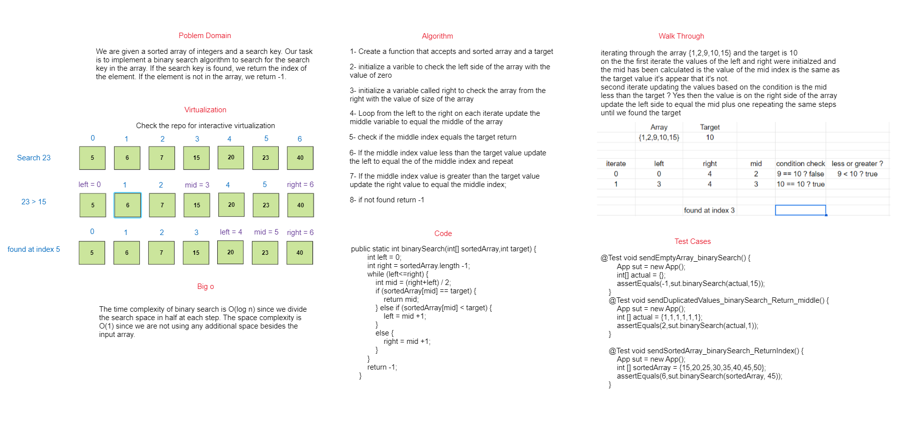

# Binary search array

---

## whiteBoard



## Virtualization


## Approach & Efficiency

- The binary search algorithm takes advantage of the fact that the input list is sorted, which allows it to quickly narrow down the possible locations of the target item. The algorithm has a time complexity of O(log n) because it divides the search space in half at each step, which reduces the search time significantly.

- We will start by finding the middle element of the array. If this element matches the search key, we will return its index. If the middle element is greater than the search key, we will perform a binary search on the left half of the array. If the middle element is less than the search key, we will perform a binary search on the right half of the array. We will continue this process until we either find the search key or determine that it is not in the array.

## Solution

### Code

```
 public static int binarySearch(int[] sortedArray,int target) {
        int left = 0;
        int right = sortedArray.length -1;
        while (left<=right) {
            int mid = (right+left) / 2;
            if (sortedArray[mid] == target) {
                return mid;
            } else if (sortedArray[mid] < target) {
                left = mid +1;
            }
            else {
                right = mid +1;
            }
        }
        return -1;
    }
```

Link -> [code](./app/bin/main/array/binary/search/App.class)

### Test

```
  @Test void sendEmptyArray_binarySearch() {
        App sut = new App();
        int[] actual = {};
        assertEquals(-1,sut.binarySearch(actual,15));
    }
    @Test void sendDuplicatedValues_binarySearch_Return_middle() {
        App sut = new App();
        int [] actual = {1,1,1,1,1,1};
        assertEquals(2,sut.binarySearch(actual,1));
    }

    @Test void sendSortedArray_binarySearch_ReturnIndex() {
        App sut = new App();
        int [] sortedArray = {15,20,25,30,35,40,45,50};
        assertEquals(6,sut.binarySearch(sortedArray, 45));
    }
```

Link -> [Test](./app/bin/test/array/binary/search/AppTest.class)


## How to run the code 

- clone the repo and cd into the array-binary-search directory.
- on the terminal type `gradle run` to run the main program.
- to run the tests type `gradlew test`.


### expected output after running 
- ```
    > Task :app:run
    index of the target is 2
    ```
- ```
    3 actionable tasks: 2 executed, 1 up-to-date
    ```