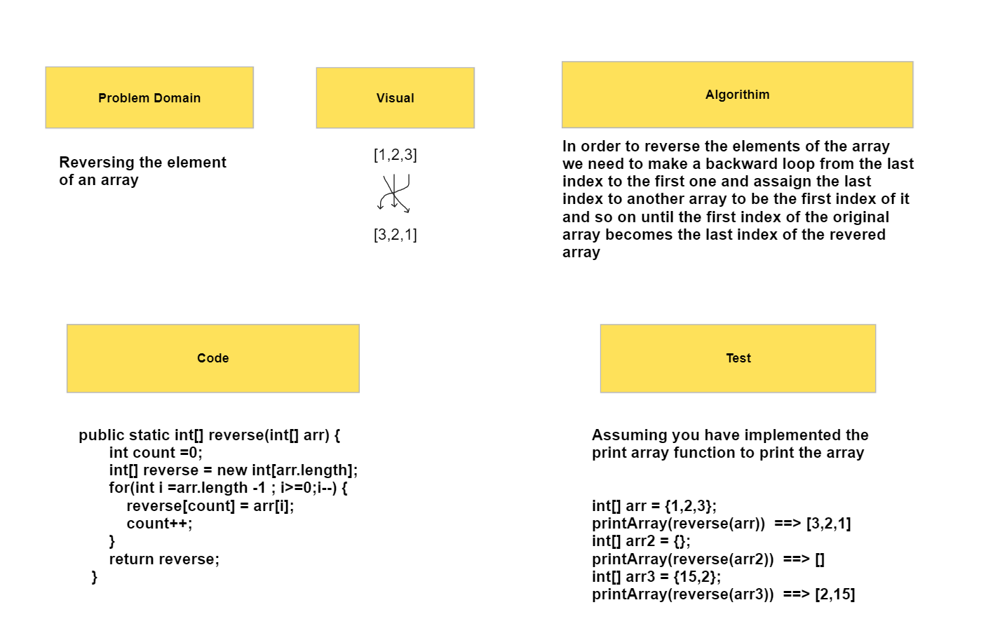

# Reverse Array Solution
---
## whiteBoard:

## Approach & Efficiency

### Problem Domain:

Reversing the elements of an array.

### visual:
input: [1,2,3] ==> output [3,2,1]

### Algorithm:
In order to reverse the elements of the array we need to make a backward loop from the last index to the first one and assaign the last index to another array to be the first index of it and so on until the first index of the original array becomes the last index of the revered array
## Solution
### Code:
```
 public static int[] reverse(int[] arr) {
        int count =0;
        int[] reverse = new int[arr.length];
        for(int i =arr.length -1 ; i>=0;i--) {
            reverse[count] = arr[i];
            count++;
        }
        return reverse;
    }
```

## Test:
```
Assuming you have implemented the print array function to print the array


int[] arr = {1,2,3};
printArray(reverse(arr))  ==> [3,2,1]
int[] arr2 = {};
printArray(reverse(arr2))  ==> []
int[] arr3 = {15,2};
printArray(reverse(arr3))  ==> [2,15]
```
