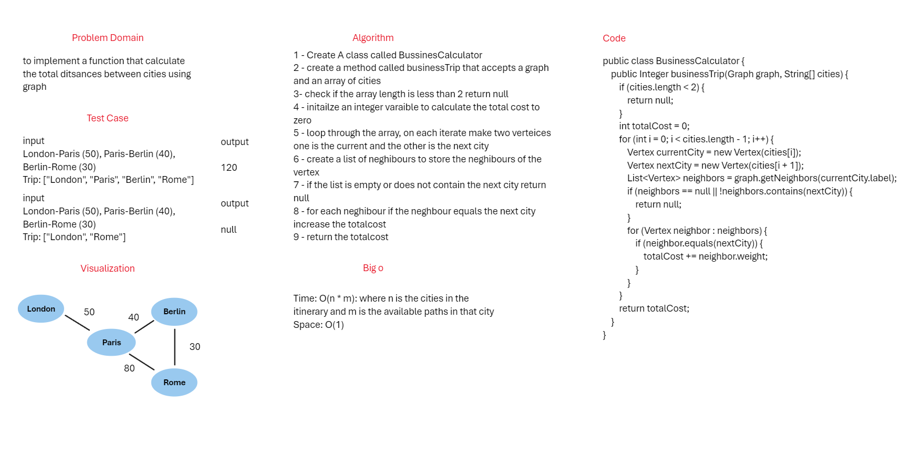

## Business Trip
to implement a function that calculate the total ditsances between cities using graph
## whiteBoard



## Approach & Efficiency
The method iterates through the array of cities, ensuring a direct connection between each consecutive pair of cities exists in the graph.
For each pair of cities, it checks the neighbors of the current city and verifies if the next city is among the neighbors.
If the next city exists in the neighbors, it accumulates the cost associated with the edge between the current city and the next city.
Finally, it returns the total accumulated cost of the trip or null if the trip is not feasible due to missing connections between cities in the graph.

## Big o

Time: O(n * m): where n is the cities in the itinerary and m is the available paths in that city
Space: O(1)

## Solution

### Code

```java
public class BusinessCalculator {
    public Integer businessTrip(Graph graph, String[] cities) {
        if (cities.length < 2) {
            return null;
        }
        int totalCost = 0;
        for (int i = 0; i < cities.length - 1; i++) {
            Vertex currentCity = new Vertex(cities[i]);
            Vertex nextCity = new Vertex(cities[i + 1]);
            List<Vertex> neighbors = graph.getNeighbors(currentCity.label);
            if (neighbors == null || !neighbors.contains(nextCity)) {
                return null;
            }
            for (Vertex neighbor : neighbors) {
                if (neighbor.equals(nextCity)) {
                    totalCost += neighbor.weight;
                }
            }
        }
        return totalCost;
    }
}
```

### Test Cases

```java
@Test
    public void testValidTripWithCost() {
        Graph citiesGraph = new Graph();
        citiesGraph.addVertex("London");
        citiesGraph.addVertex("Paris");
        citiesGraph.addVertex("Berlin");
        citiesGraph.addVertex("Rome");

        citiesGraph.addEdge("London", "Paris", 50);
        citiesGraph.addEdge("Paris", "Berlin", 40);
        citiesGraph.addEdge("Berlin", "Rome", 30);

        BusinessCalculator calculator = new BusinessCalculator();
        String[] trip = {"London", "Paris", "Berlin", "Rome"};
        Integer cost = calculator.businessTrip(citiesGraph, trip);
        assertEquals(Integer.valueOf(120), cost);
    }

    @Test
    public void testInvalidTripNoConnection() {
        Graph citiesGraph = new Graph();
        citiesGraph.addVertex("London");
        citiesGraph.addVertex("Paris");
        citiesGraph.addVertex("Berlin");
        citiesGraph.addVertex("Rome");

        citiesGraph.addEdge("London", "Paris", 50);
        citiesGraph.addEdge("Berlin", "Rome", 30);

        BusinessCalculator calculator = new BusinessCalculator();
        String[] trip = {"London", "Rome"};
        Integer cost = calculator.businessTrip(citiesGraph, trip);
        assertEquals(null, cost);
    }

    @Test
    public void testInvalidTripInsufficientCities() {
        Graph citiesGraph = new Graph();
        citiesGraph.addVertex("London");
        citiesGraph.addVertex("Paris");
        citiesGraph.addVertex("Berlin");
        citiesGraph.addVertex("Rome");

        BusinessCalculator calculator = new BusinessCalculator();
        String[] trip = {"Berlin"};
        Integer cost = calculator.businessTrip(citiesGraph, trip);
        assertEquals(null, cost);
    }
```