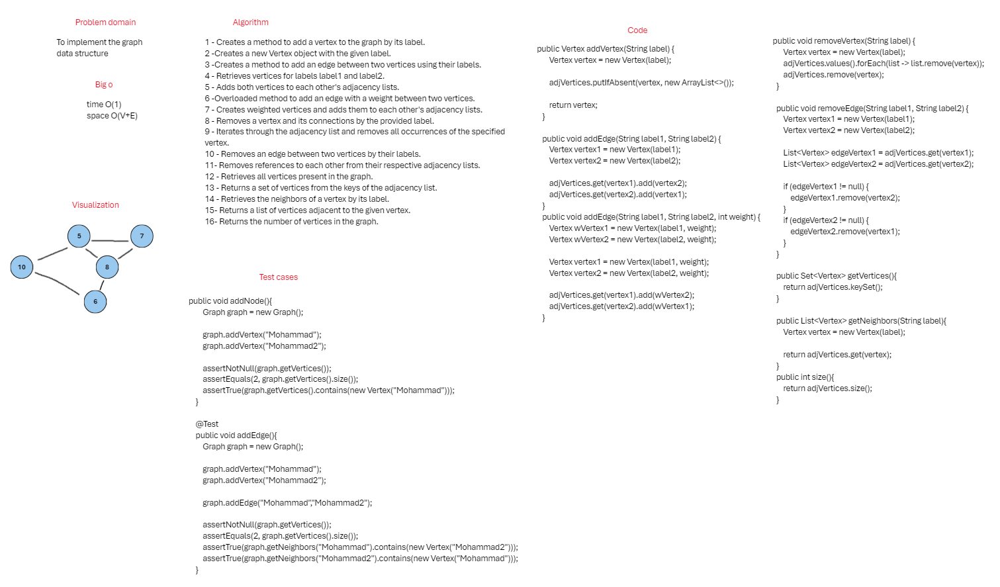

## Graph
This is a simple implementation of a graph data structure in Java.

## whiteBoard



## Approach & Efficiency
The graph is implemented using an adjacency list representation. The edj_list dictionary is used to store the vertices as keys and their corresponding edges as values. The space complexity of this implementation is O(V + E), where V is the number of vertices and E is the number of edges.

Adding a vertex takes O(1) time complexity.
Adding an edge takes O(1) time complexity.
Retrieving the vertices takes O(V) time complexity.
Retrieving the neighbors of a vertex takes O(1) time complexity.
Finding the size of the graph takes O(1) time complexity.

## Solution

### Code
```java
public class Graph {
    private final Map<Vertex, List<Vertex>> adjVertices;

    public Graph() {
        adjVertices = new HashMap<>();
    }

    public Vertex addVertex(String label) {
        Vertex vertex = new Vertex(label);

        adjVertices.putIfAbsent(vertex, new ArrayList<>());

        return vertex;
    }

    public void addEdge(String label1, String label2) {
        Vertex vertex1 = new Vertex(label1);
        Vertex vertex2 = new Vertex(label2);

        adjVertices.get(vertex1).add(vertex2);
        adjVertices.get(vertex2).add(vertex1);
    }
    public void addEdge(String label1, String label2, int weight) {
        Vertex wVertex1 = new Vertex(label1, weight);
        Vertex wVertex2 = new Vertex(label2, weight);

        Vertex vertex1 = new Vertex(label1, weight);
        Vertex vertex2 = new Vertex(label2, weight);

        adjVertices.get(vertex1).add(wVertex2);
        adjVertices.get(vertex2).add(wVertex1);
    }

    public void removeVertex(String label) {
        Vertex vertex = new Vertex(label);
        adjVertices.values().forEach(list -> list.remove(vertex));
        adjVertices.remove(vertex);
    }

    public void removeEdge(String label1, String label2) {
        Vertex vertex1 = new Vertex(label1);
        Vertex vertex2 = new Vertex(label2);

        List<Vertex> edgeVertex1 = adjVertices.get(vertex1);
        List<Vertex> edgeVertex2 = adjVertices.get(vertex2);

        if (edgeVertex1 != null) {
            edgeVertex1.remove(vertex2);
        }
        if (edgeVertex2 != null) {
            edgeVertex2.remove(vertex1);
        }
    }

    public Set<Vertex> getVertices(){
        return adjVertices.keySet();
    }

    public List<Vertex> getNeighbors(String label){
        Vertex vertex = new Vertex(label);

        return adjVertices.get(vertex);
    }
    public int size(){
        return adjVertices.size();
    }

    public String printGraph() {
        StringBuilder stringBuilder = new StringBuilder();
        for (Vertex vertex : adjVertices.keySet()) {
            stringBuilder.append(vertex);
            stringBuilder.append(adjVertices.get(vertex));
        }
        return stringBuilder.toString();
    }

}
```

### Tests

```java
class AppTest {
    @Test
    public void addNode(){
        Graph graph = new Graph();

        graph.addVertex("Mohammad");
        graph.addVertex("Mohammad2");

        assertNotNull(graph.getVertices());
        assertEquals(2, graph.getVertices().size());
        assertTrue(graph.getVertices().contains(new Vertex("Mohammad")));
    }

    @Test
    public void addEdge(){
        Graph graph = new Graph();

        graph.addVertex("Mohammad");
        graph.addVertex("Mohammad2");

        graph.addEdge("Mohammad","Mohammad2");

        assertNotNull(graph.getVertices());
        assertEquals(2, graph.getVertices().size());
        assertTrue(graph.getNeighbors("Mohammad").contains(new Vertex("Mohammad2")));
        assertTrue(graph.getNeighbors("Mohammad2").contains(new Vertex("Mohammad")));
    }

    @Test
    public void allNodes(){
        Graph graph = new Graph();

        graph.addVertex("Mohammad");
        graph.addVertex("Mohammad2");
        graph.addVertex("Mohammad3");

        assertEquals(3, graph.getVertices().size());
        assertTrue(graph.getVertices().contains(new Vertex("Mohammad")));
        assertTrue(graph.getVertices().contains(new Vertex("Mohammad2")));
        assertTrue(graph.getVertices().contains(new Vertex("Mohammad3")));
        assertFalse(graph.getVertices().contains(new Vertex("Mohammad4")));
    }

    @Test
    public void nodeNeighbors(){
        Graph graph = new Graph();

        graph.addVertex("Mohammad");
        graph.addVertex("Mohammad2");

        graph.addEdge("Mohammad","Mohammad2");

        assertEquals(1, graph.getNeighbors("Mohammad").size());
        assertTrue(graph.getNeighbors("Mohammad").contains(new Vertex("Mohammad2")));
        assertTrue(graph.getNeighbors("Mohammad2").contains(new Vertex("Mohammad")));
    }

    @Test
    public void nodeNeighborsWeight(){
        Graph graph = new Graph();

        graph.addVertex("Mohammad");
        graph.addVertex("Mohammad2");
        graph.addVertex("Mohammad3");

        graph.addEdge("Mohammad","Mohammad2",3);
        graph.addEdge("Mohammad","Mohammad3",2);

        assertEquals(2, graph.getNeighbors("Mohammad").size());
        assertEquals(3, graph.getNeighbors("Mohammad").get(0).weight);
        assertEquals(2, graph.getNeighbors("Mohammad").get(1).weight);
    }

    @Test
    public void emptyGraph(){
        Graph graph = new Graph();

        assertNull(graph.getNeighbors("Mohammad"));
    }

    @Test
    public void oneNodeOneEdge(){
        Graph graph = new Graph();
        graph.addVertex("Mohammad");
        graph.addEdge("Mohammad","Mohammad");

        System.out.println(graph.getNeighbors("Mohammad"));

        assertEquals(2, graph.getNeighbors("Mohammad").size());
        assertTrue( graph.getNeighbors("Mohammad").contains(new Vertex("Mohammad")));
        assertEquals(1, graph.getVertices().size());

    }
}
```