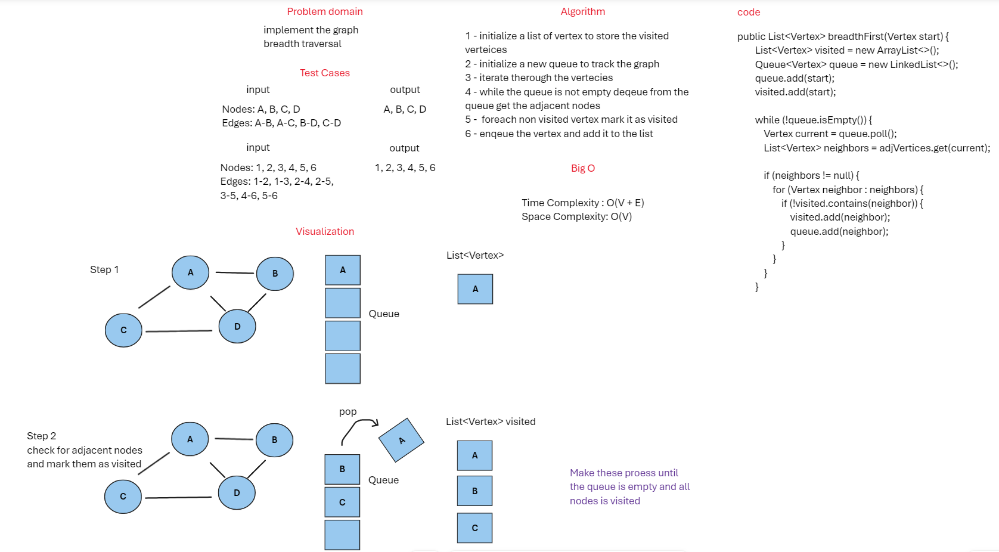

## Graph Breadth Traversal
This is a simple implementation of a graph breadth in Java.

## whiteBoard



## Approach & Efficiency
1. initialize a list of vertex to store the visited verteices
2. initialize a new queue to track the graph
3. iterate therough the vertecies
4. while the queue is not empty deqeue from the queue get the adjacent nodes
5. foreach non visited vertex mark it as visited
6. enqeue the vertex and add it to the list

### Big o
Time Complexity : O(V + E)
Space Complexity: O(V)

## Solution

### Code
```java
public List<Vertex> breadthFirst(Vertex start) {
        List<Vertex> visited = new ArrayList<>();
        Queue<Vertex> queue = new LinkedList<>();
        queue.add(start);
        visited.add(start);

        while (!queue.isEmpty()) {
        Vertex current = queue.poll();
        List<Vertex> neighbors = adjVertices.get(current);

        if (neighbors != null) {
        for (Vertex neighbor : neighbors) {
        if (!visited.contains(neighbor)) {
        visited.add(neighbor);
        queue.add(neighbor);
        }
        }
        }
        }
```

### Tests

```java
 @Test
public void breadthFirstTraversal() {
        Graph testGraph = new Graph();
        Vertex v1 = testGraph.addVertex("A");
        testGraph.addVertex("B");
        testGraph.addVertex("C");
        testGraph.addVertex("D");
        testGraph.addEdge("A", "B");
        testGraph.addEdge("A", "C");
        testGraph.addEdge("B", "D");
        testGraph.addEdge("C", "D");
        assertEquals(4, testGraph.size());
        assertEquals(4, testGraph.getVertices().size());
        List<Vertex> bfsResult = testGraph.breadthFirst(v1);
        assertEquals("A", bfsResult.get(0).label);
        assertEquals("B", bfsResult.get(1).label);
        assertEquals("C", bfsResult.get(2).label);
        assertEquals("D", bfsResult.get(3).label);
        }
```