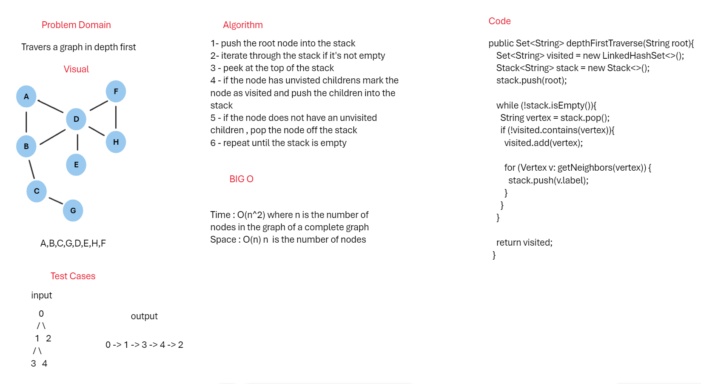

## Graph Depth Traversal
This is a simple implementation of a graph Depth in Java.

## whiteBoard



## Approach & Efficiency
The approach used is to push the root into the stack and start to check
the visited and unvisited vertices if visited pop from the stack else push into the stack and check the children

### Big o
Time Complexity : O(n^2)
Space Complexity: O(N)

## Solution

### Code
```java
public Set<String> depthFirstTraverse(String root){
        Set<String> visited = new LinkedHashSet<>();
        Stack<String> stack = new Stack<>();
        stack.push(root);

        while (!stack.isEmpty()){
        String vertex = stack.pop();
        if (!visited.contains(vertex)){
        visited.add(vertex);

        for (Vertex v: getNeighbors(vertex)) {
        stack.push(v.label);
        }
        }
        }

        return visited;
        }
```

### Tests

```java
@Test
public void testDepthFirstTraverse(){
        Graph graph = new Graph();
        graph.addVertex("A");
        graph.addVertex("B");
        graph.addVertex("C");
        graph.addVertex("D");
        graph.addVertex("E");
        graph.addVertex("F");
        graph.addVertex("G");
        graph.addVertex("H");

        graph.addEdge("A","D");
        graph.addEdge("A","B");
        graph.addEdge("B","D");
        graph.addEdge("B","C");
        graph.addEdge("C","G");
        graph.addEdge("D","F");
        graph.addEdge("D","H");
        graph.addEdge("D","E");
        graph.addEdge("F","H");

        List<String> list = new ArrayList<>();
        list.add("A");
        list.add("B");
        list.add("C");
        list.add("G");
        list.add("D");
        list.add("E");
        list.add("H");
        list.add("F");

        Set<String> result = graph.depthFirstTraverse("A");

        assertTrue(result.contains(list.get(0)));
        assertTrue(result.contains(list.get(1)));
        assertTrue(result.contains(list.get(2)));
        assertTrue(result.contains(list.get(3)));
        assertTrue(result.contains(list.get(4)));
        assertTrue(result.contains(list.get(5)));
        assertTrue(result.contains(list.get(6)));
        assertTrue(result.contains(list.get(7)));
        }
```