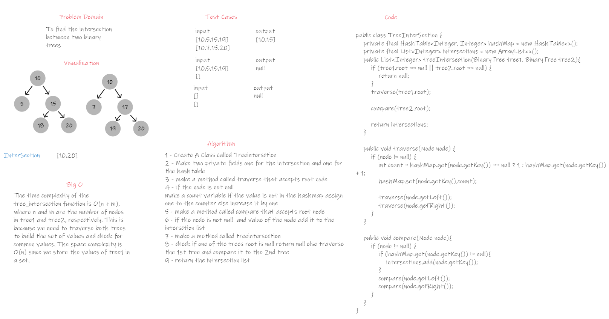

# TreeInterSection

## Summary

This is an implementation of 2 binary trees called treeintersection to find the common nodes in both trees

### WhiteBoard



### Approach & Efficiency
The approach used is to traverse through the first tree and add the values as a key in the hashmap with a counter
then compare the keys with the values of the second if it found this means that it has an intersection.
### Big O

The time complexity of the tree_intersection function is O(n + m), where n and m are the number of nodes in tree1 and
tree2, respectively. This is because we need to traverse both trees to build the set of values and check for common
values. The space complexity is O(n) since we store the values of tree1 in a set.

### Solution

#### Code
```java
public class TreeInterSection {
    private final HashTable<Integer, Integer> hashMap = new HashTable<>();
    private final List<Integer> intersections = new ArrayList<>();
    public List<Integer> treeIntersection(BinaryTree tree1, BinaryTree tree2){
        if (tree1.root == null || tree2.root == null) {
            return null;
        }
        traverse(tree1.root);

        compare(tree2.root);

        return intersections;
    }

    public void traverse(Node node) {
        if (node != null) {
            int count = hashMap.get(node.getKey()) == null ? 1 : hashMap.get(node.getKey()) + 1;
            hashMap.set(node.getKey(),count);

            traverse(node.getLeft());
            traverse(node.getRight());
        }
    }

    public void compare(Node node){
        if (node != null) {
            if (hashMap.get(node.getKey()) != null){
                intersections.add(node.getKey());
            }
            compare(node.getLeft());
            compare(node.getRight());
        }
    }
}
```

#### Test

```java
 @Test
    public void intersection(){
        List<Integer> list = treeInterSection.treeIntersection(binaryTree1,binaryTree2);

        assertTrue(list.contains(1));
        assertTrue(list.contains(8));
        assertTrue(list.contains(41));
        assertFalse(list.contains(7));
    }

    @Test
    public void intersection2(){
        List<Integer> list2 = treeInterSection.treeIntersection(binaryTree1,binaryTree3);
        assertTrue(list2.contains(8));
        assertFalse(list2.contains(41));
        assertFalse(list2.contains(7));
    }

    @Test
    public void intersection3(){
        List<Integer> list2 = treeInterSection.treeIntersection(binaryTree4,binaryTree3);

        assertEquals(0, list2.size());
        assertFalse(list2.contains(41));
        assertFalse(list2.contains(7));
    }
```