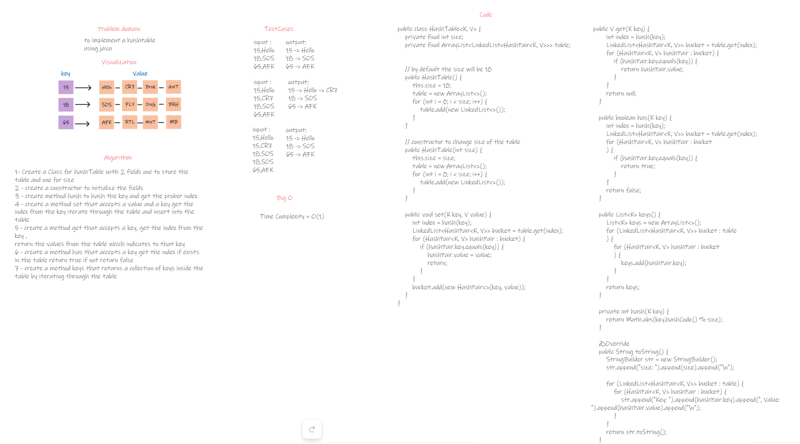

# HashTable

## Summary

This is an implementation of hashtable in java. A hash table is a data structure that is used to store keys/value pairs. It uses a hash function to compute an index into an array in which an element will be inserted or searched.

### WhiteBoard



### Approach & Efficiency
The hashTable class consists of 2 fields which are size and a table. the table is a array of linked-list to store multiple data 
to one key using this approach the hashtable will be more sufficient and reliable 
### Big o
- set(key, value): the worst case, it can be O(n) if there are many collisions in the same bucket.
- get(key): the worst case, it can be O(n) if there are many collisions in the same bucket.
- has(key): the worst case, it can be O(n) if there are many collisions in the same bucket.
- keys(): The time complexity is O(n), where n is the number of key-value pairs in the Hashtable.
- hash(key): The time complexity is O(1), as it involves a simple hash function.

### Code 

```java
public class HashTable<K, V> {
    private final int size;
    private final ArrayList<LinkedList<HashPair<K, V>>> table;


    // by default the size will be 10
    public HashTable() {
        this.size = 10;
        table = new ArrayList<>();
        for (int i = 0; i < size; i++) {
            table.add(new LinkedList<>());
        }
    }

    // constructor to change size of the table
    public HashTable(int size) {
        this.size = size;
        table = new ArrayList<>();
        for (int i = 0; i < size; i++) {
            table.add(new LinkedList<>());
        }
    }

    public void set(K key, V value) {
        int index = hash(key);
        LinkedList<HashPair<K, V>> bucket = table.get(index);
        for (HashPair<K, V> hashPair : bucket) {
            if (hashPair.key.equals(key)) {
                hashPair.value = value;
                return;
            }
        }
        bucket.add(new HashPair<>(key, value));
    }

    public V get(K key) {
        int index = hash(key);
        LinkedList<HashPair<K, V>> bucket = table.get(index);
        for (HashPair<K, V> hashPair : bucket) {
            if (hashPair.key.equals(key)) {
                return hashPair.value;
            }
        }
        return null;
    }

    public boolean has(K key) {
        int index = hash(key);
        LinkedList<HashPair<K, V>> bucket = table.get(index);
        for (HashPair<K, V> hashPair : bucket
        ) {
            if (hashPair.key.equals(key)) {
                return true;
            }
        }
        return false;
    }

    public List<K> keys() {
        List<K> keys = new ArrayList<>();
        for (LinkedList<HashPair<K, V>> bucket : table
        ) {
            for (HashPair<K, V> hashPair : bucket
            ) {
                keys.add(hashPair.key);
            }
        }
        return keys;
    }

    private int hash(K key) {
        return Math.abs(key.hashCode() % size);
    }

    @Override
    public String toString() {
        StringBuilder str = new StringBuilder();
        str.append("size: ").append(size).append("\n");

        for (LinkedList<HashPair<K, V>> bucket : table) {
            for (HashPair<K, V> hashPair : bucket) {
                str.append("Key: ").append(hashPair.key).append(", Value: ").append(hashPair.value).append("\n");
            }
        }
        return str.toString();
    }
}
```

***The Pair class***
```java
public class HashPair<K,V> {
    K key;
    V value;
    public HashPair(K key , V value){
        this.key = key;
        this.value = value;
    }

    @Override
    public String toString() {
        return "HashPair{" +
                "key=" + key +
                ", value=" + value +
                '}';
    }
}
```

### Test Cases

```java
class HashTableTest {
    @Test
    public void givenAnEmptyHashTableReturnNull(){
        HashTable<String,Integer> hashTable = new HashTable<>();
        assertTrue(hashTable.keys().isEmpty());
        assertNull(hashTable.get("SortOfAKey"));
        assertFalse(hashTable.has("SortOfAKey"));
    }
    @Test
    public void givenAHashTableWithSomeDataReturnTheData(){
        HashTable<String,String> hashTable = new HashTable<>();

        hashTable.set("BIRTHDATE","1999");
        hashTable.set("CURRENCY","JOD");
        hashTable.set("NAME","MOHAMMAD");

        assertTrue(hashTable.has("BIRTHDATE"));
        assertTrue(hashTable.has("CURRENCY"));

        assertEquals("1999",hashTable.get("BIRTHDATE"));
        assertEquals("MOHAMMAD",hashTable.get("NAME"));
    }
    @Test
    public void givenAHashTableCheckForConsistentOfKeys(){
        HashTable<String,String> movieHashTable = new HashTable<>();
        movieHashTable.set("movieName","London Has Fallen");
        movieHashTable.set("movieRelease","2016");
        movieHashTable.set("movieStar","Gerard Butler");

        assertTrue(movieHashTable.has("movieName"));
        assertTrue(movieHashTable.has("movieStar"));
        assertTrue(movieHashTable.has("movieRelease"));
    }
    @Test
    public void givenAHashTableWithSomeCollision(){
        HashTable<String, Integer> hashtable = new HashTable<>(1);
        hashtable.set("a", 1);
        hashtable.set("a", 2);

        assertEquals(2, hashtable.get("a"));
    }
}
```