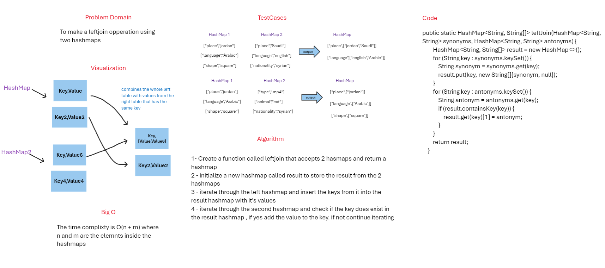

# HashTable

## Summary

This is an implementation of left join operation using hashmaps
### WhiteBoard



### Approach & Efficiency
the approach used is to store the left hash map in the result hashmap then check if the second hashmap contains a key similar to the one in the result hashmap
if yes then we can add it to the result hashmap
### Big o
The time complixty is O(n + m) where n and m are the elemnts inside the hashmaps

### Code

```java
public static HashMap<String, String[]> leftJoin(HashMap<String, String> synonyms, HashMap<String, String> antonyms) {
        HashMap<String, String[]> result = new HashMap<>();
        for (String key : synonyms.keySet()) {
        String synonym = synonyms.get(key);
        result.put(key, new String[]{synonym, null});
        }
        for (String key : antonyms.keySet()) {
        String antonym = antonyms.get(key);
        if (result.containsKey(key)) {
        result.get(key)[1] = antonym;
        }
        }
        return result;
        }
```


### Test Cases

```java
public class LeftJoinTest {

    @Test
    public void noMatchingWordsIn_A_LeftJoinShouldReturnOnlyTheLeftHashMap() {
        HashMap<String,String> hs1 = new HashMap<>();
        hs1.put("place","jordan");
        hs1.put("animal","cat");
        hs1.put("shape","square");
        HashMap<String,String> hs2 = new HashMap<>();
        hs2.put("type",".mp4");
        hs2.put("language","english");
        hs2.put("nationality","syrian");

        HashMap<String,String[]> result = LeftJoin.leftJoin(hs1,hs2);
        assertEquals(hs1.size(),result.size());
        for (String key: result.keySet()
        ) {
            assertEquals(result.containsKey(key),hs1.containsKey(key));
        }
        result.clear();
        result = LeftJoin.leftJoin(hs2,hs1);
        assertEquals(hs2.size(),result.size());
        for (String key: result.keySet()
        ) {
            assertEquals(result.containsKey(key),hs2.containsKey(key));
        }
    }

    @Test
    public void matchingWordsShould_ReturnTheLeftHashMap_InAdditionTo_TheMatchedWords_InTheRightHashmap(){
        HashMap<String,String> hs1 = new HashMap<>();
        hs1.put("place","jordan");
        hs1.put("language","Arabic");
        hs1.put("shape","square");
        HashMap<String,String> hs2 = new HashMap<>();
        hs2.put("place","Saudi");
        hs2.put("language","english");
        hs2.put("nationality","syrian");

        HashMap<String,String[]> result = LeftJoin.leftJoin(hs1,hs2);
        assertEquals(hs1.size(),result.size());
        for (String key: result.keySet()
        ) {
            assertEquals(result.containsKey(key),hs1.containsKey(key));
        }
    }
}
```