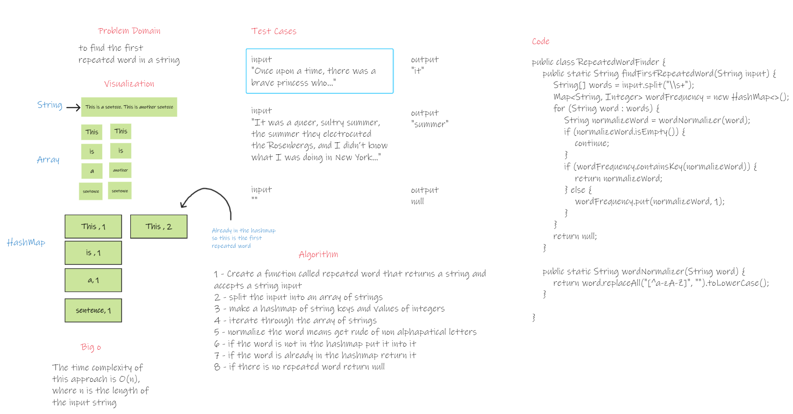

#  hashmap-repeated-word


## Whiteboard Process


## Approach & Efficiency

# Approach
The approach used is to split the string into array of strings and insert every non repeated word into a hashmap
until there is a repeated word found in the hashmap it will return it.


# Efficiency
Time Complexity: The time complexity of this approach is O(n), where n is the length of the input string.
Space Complexity: The space complexity of this approach is also O(n) because we use a HashMap to store the frequency of each unique word. In the worst case, if all words are unique, the space complexity remains O(n).
## Solution

### Code 

```java
public static String findFirstRepeatedWord(String input) {
        String[] words = input.split("\\s+");
        Map<String, Integer> wordFrequency = new HashMap<>();
        for (String word : words) {
            String normalizeWord = wordNormalizer(word);
            if (normalizeWord.isEmpty()) {
                continue;
            }
            if (wordFrequency.containsKey(normalizeWord)) {
                return normalizeWord;
            } else {
                wordFrequency.put(normalizeWord, 1);
            }
        }
        return null;
    }

    public static String wordNormalizer(String word) {
        return word.replaceAll("[^a-zA-Z]", "").toLowerCase();
    }
```

### Test

```java
public class findReapeatedWordTest {
    @Test
    public void firstRepeatedWordInEmptyString() {
        String input = "";
        String result = RepeatedWordFinder.findFirstRepeatedWord(input);
        assertNull(result);
    }

    @Test
    public void firstRepeatedWordInUniqueWords() {
        String input = "Good Afternoon gentlemen.";
        String result = RepeatedWordFinder.findFirstRepeatedWord(input);
        assertNull(result);
    }

    @Test
    public void firstRepeatedWordInMultipleSentences() {
        String input = "Mohammad went to the shop. Mohammad is now in the garden";
        String result = RepeatedWordFinder.findFirstRepeatedWord(input);
        assertEquals("mohammad", result);
    }

    @Test
    public void firstRepeatedWordWithPunctuation() {
        String input = "play! What do you want to play.";
        String result = RepeatedWordFinder.findFirstRepeatedWord(input);
        assertEquals("play", result);
    }

}
```