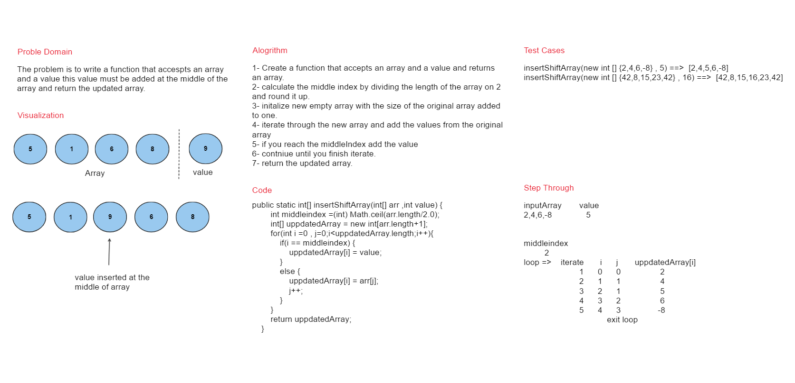

# Insert Shift Array

---

## whiteBoard



## Approach & Efficiency
The approach taken here is to insert a value in the middle index of an array through iterating on the new array and insert the value based on the middle index

## Solution

### Code

```
 public static int[] insertShiftArray(int[] arr ,int value) {
        int middleindex =(int) Math.ceil(arr.length/2.0);
        int[] uppdatedArray = new int[arr.length+1];
        for(int i =0 , j=0;i<uppdatedArray.length;i++){
            if(i == middleindex) {
                uppdatedArray[i] = value;
            }
            else {
                uppdatedArray[i] = arr[j];
                j++;
            }
        }
        return uppdatedArray;
    }
```
Link -> [code](./lib/src/main/java/insertshiftarray/Library.java)
### Test
```
 @Test void insertArrayAndValue_With_EvenLength_ReturnUpdatedArray() {
        Library sut = new Library();
        int [] actual = sut.insertShiftArray(new int[] {5,1,6,8},9);
        Assertions.assertArrayEquals(new int[] {5,1,9,6,8},actual) ;
    }
    @Test void insertArrayAndValue_With_OddLength_ReturnUpdatedArray() {
        Library sut = new Library();
        int [] actual = sut.insertShiftArray(new int[] {42,8,15,23,42},16);
        Assertions.assertArrayEquals(new int[] {42,8,15,16,23,42},actual) ;
    }
```
Link -> [Test](./lib/src/test/java/insertshiftarray/LibraryTest.java)