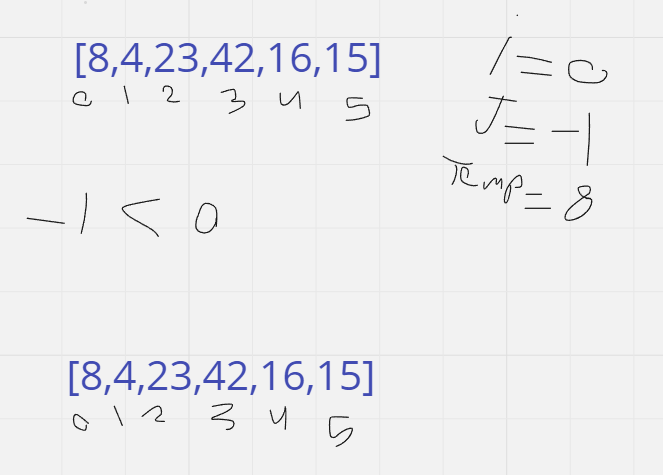
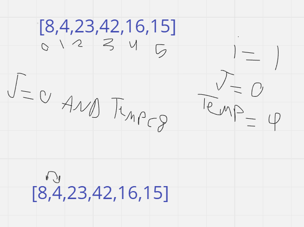
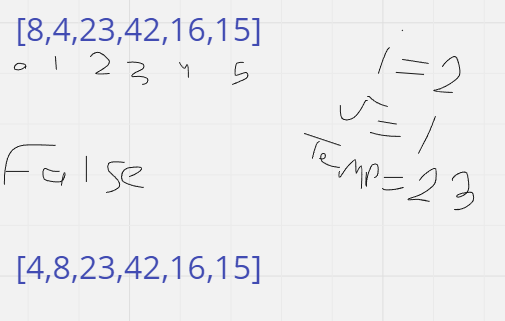
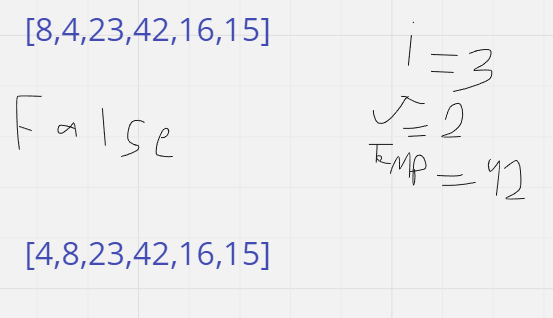
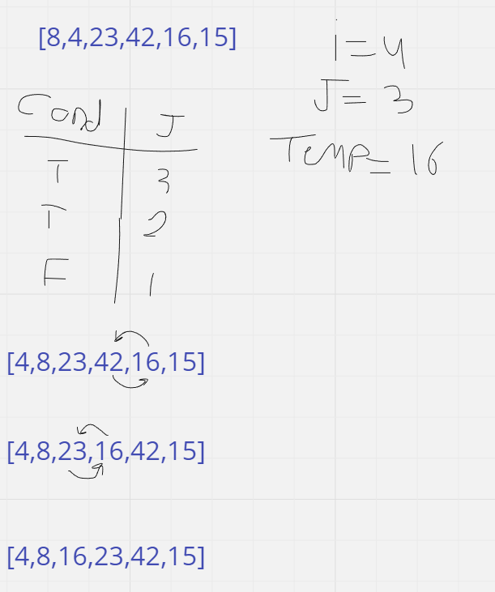
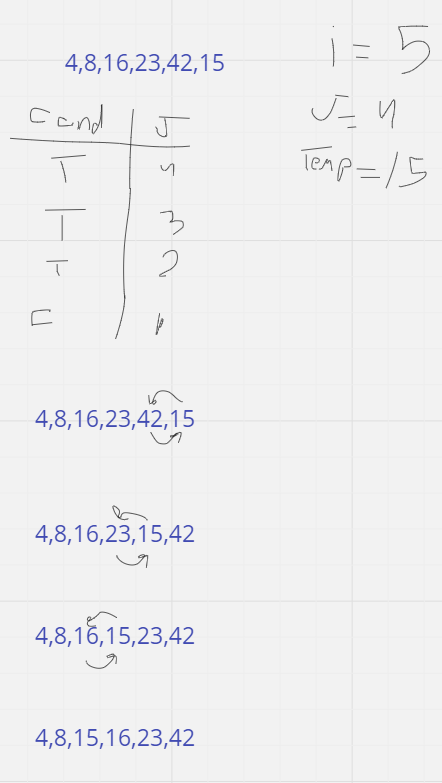

# Insertion Sort

the idea behind Insertion Sort is that it loops through the array and compare each value with all the predecessors' values and if the value directly before is less than the current value nothing will happen, but if the value was larger than the current value replace them and compare the same value with the second predecessor and so on.

## PseduoCode

```
Insert(int[] sorted, int value)
  initialize i to 0
  WHILE value > sorted[i]
    set i to i + 1
  WHILE i < sorted.length
    set temp to sorted[i]
    set sorted[i] to value
    set value to temp
    set i to i + 1
  append value to sorted

InsertionSort(int[] input)
  LET sorted = New Empty Array
  sorted[0] = input[0]
  FOR i from 1 up to input.length
    Insert(sorted, input[i])
  return sorted
```

### Code 

```java
public class InsertionSort {
    public void sort(int[] arr) throws Exception {
        try {
            int length = arr.length;
            for (int i = 1; i < length; ++i) {
                int key = arr[i];
                int j = i - 1;
                while (j >= 0 && arr[j] > key) {
                    arr[j + 1] = arr[j];
                    j = j - 1;
                }
                arr[j + 1] = key;
            }
        } catch (IllegalArgumentException e){
            e.printStackTrace();
        }
    }
}
```

## Trace

Array = [8,4,23,42,16,15]














### Big o

- Time: O(n^2) Insertion sort takes maximum time to sort if elements are sorted in reverse order. And it takes minimum time (Order of n) when elements are already sorted.
- Space: O(1) No additional space is being created. This array is being sorted in place…keeping the space at constant O(1).