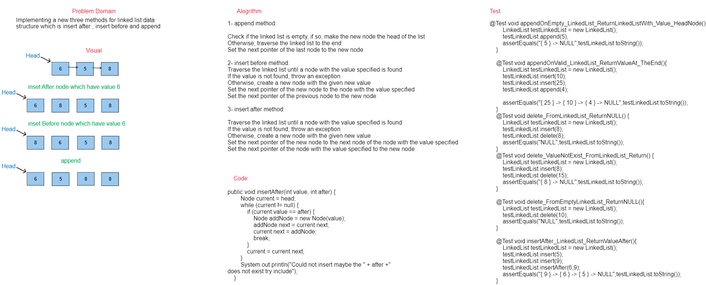
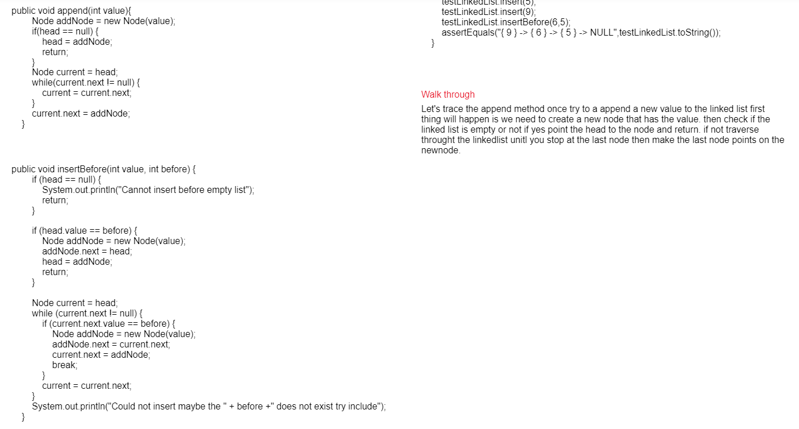

## Challenge

This challenge is to implement more methods on the linked list data structure which is `insert After , insert berfore , append`.

## WhiteBoard




## Approach & Efficiency

- **Append method**: Check if the linked list is empty, if so, make the new node the head of the list Otherwise, traverse the linked list to the end Set the next pointer of the last node to the new node.
- **insert before method**:Traverse the linked list until a node with the value specified is found If the value is not found, throw an exception Otherwise, create a new node with the given new value Set the next pointer of the new node to the node with the value specified Set the next pointer of the previous node to the new node.
- **insert after method**: Traverse the linked list until a node with the value specified is found If the value is not found, throw an exception Otherwise, create a new node with the given new value Set the next pointer of the new node to the next node of the node with the value specified Set the next pointer of the node with the value specified to the new node

## Solution

### Code 
```java
public void append(int value){
        Node addNode = new Node(value);
        if(head == null) {
            head = addNode;
            return;
        }
        Node current = head;
        while(current.next != null) {
            current = current.next;
        }
        current.next = addNode;
    }
    public void insertAfter(int value, int after) {
        Node current = head;
        while (current != null) {
            if (current.value == after) {
                Node addNode = new Node(value);
                addNode.next = current.next;
                current.next = addNode;
                break;
            }
            current = current.next;
        }
        System.out.println("Could not insert maybe the " + after +" does not exist try include");
    }
    public void insertBefore(int value, int before) {
        if (head == null) {
            System.out.println("Cannot insert before empty list");
            return;
        }

        if (head.value == before) {
            Node addNode = new Node(value);
            addNode.next = head;
            head = addNode;
            return;
        }

        Node current = head;
        while (current.next != null) {
            if (current.next.value == before) {
                Node addNode = new Node(value);
                addNode.next = current.next;
                current.next = addNode;
                break;
            }
            current = current.next;
        }
        System.out.println("Could not insert maybe the " + before +" does not exist try include");
    }
    public void delete(int value) {
        if (head == null) {
            System.out.println("List is empty");
            return;
        }

        if (head.value == value) {
            head = head.next;
            return;
        }

        Node current = head;
        while (current.next != null) {
            if (current.next.value == value) {
                current.next = current.next.next;
                return;
            }
            current = current.next;
        }
        System.out.println("Value does not exist");
    }
```

### Test

```java
@Test void appendOnEmpty_LinkedList_ReturnLinkedListWith_Value_HeadNode(){
        LinkedList testLinkedList = new LinkedList();
        testLinkedList.append(5);
        assertEquals("{ 5 } -> NULL",testLinkedList.toString());
    }

    @Test void appendOnValid_LinkedList_ReturnValueAt_TheEnd(){
        LinkedList testLinkedList = new LinkedList();
        testLinkedList.insert(10);
        testLinkedList.insert(25);
        testLinkedList.append(4);

        assertEquals("{ 25 } -> { 10 } -> { 4 } -> NULL",testLinkedList.toString());
    }
    @Test void delete_FromLinkedList_ReturnNULL() {
        LinkedList testLinkedList = new LinkedList();
        testLinkedList.insert(8);
        testLinkedList.delete(8);
        assertEquals("NULL",testLinkedList.toString());
    }
    @Test void delete_ValueNotExist_FromLinkedList_Return() {
        LinkedList testLinkedList = new LinkedList();
        testLinkedList.insert(8);
        testLinkedList.delete(15);
        assertEquals("{ 8 } -> NULL",testLinkedList.toString());
    }

    @Test void delete_FromEmptyLinkedList_ReturnNULL(){
        LinkedList testLinkedList = new LinkedList();
        testLinkedList.delete(10);
        assertEquals("NULL",testLinkedList.toString());
    }

    @Test void insertAfter_LinkedList_ReturnValueAfter(){
        LinkedList testLinkedList = new LinkedList();
        testLinkedList.insert(5);
        testLinkedList.insert(9);
        testLinkedList.insertAfter(6,9);
        assertEquals("{ 9 } -> { 6 } -> { 5 } -> NULL",testLinkedList.toString());
    }
    @Test void insertBefore_LinkedList_ReturnValueBefore(){
        LinkedList testLinkedList = new LinkedList();
        testLinkedList.insert(5);
        testLinkedList.insert(9);
        testLinkedList.insertBefore(6,5);
        assertEquals("{ 9 } -> { 6 } -> { 5 } -> NULL",testLinkedList.toString());
    }
```