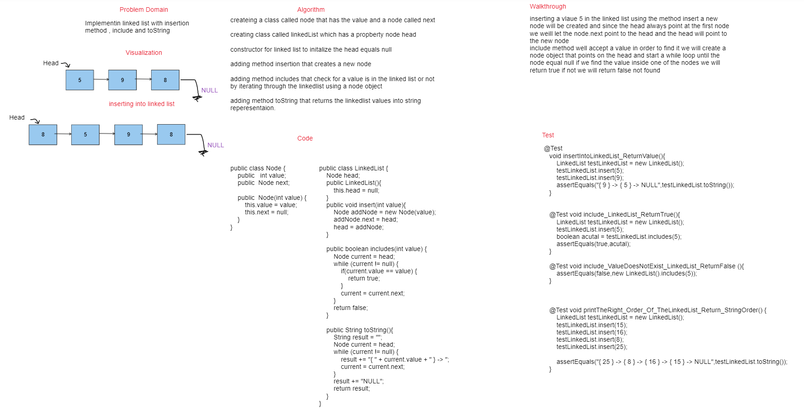

# Singly Linked List

## Summary

This is an implementation of a singly linked list data structure in Java. It includes a Node class with properties for the node's value and pointer to the next node, and a LinkedList class with a head property and methods for inserting a new node at the head, checking if a value exists in the list, and returning a string representation of the list.

## whiteboard



## Approach & Efficiency

The Node class has a constant time complexity of O(1) for creating a new node object. The LinkedList class has a constant time complexity of O(1) for creating a new empty linked list object.

The insert method of the LinkedList class has a constant time complexity of O(1) for inserting a new node at the head of the list.

The includes method of the LinkedList class has a linear time complexity of O(n) in the worst case, where n is the number of nodes in the list. This is because the method needs to traverse the list until it finds the value it's looking for or reaches the end of the list.

The to_string method of the LinkedList class also has a linear time complexity of O(n) in the worst case, because it needs to traverse the list and concatenate the string representation of each node.

## Solution

The solution consists of two classes:

1. Node: A class representing a node in the linked list, with properties for the node's value and pointer to the next node.

2. LinkedList: A class representing the linked list, with a head property and methods for inserting a new node at the head, checking if a value exists in the list, and returning a string representation of the list.


## Code 

Node Class
```java
public class Node {
    public   int value;
    public  Node next;

    public  Node(int value) {
        this.value = value;
        this.next = null;
    }
}
```

Linked List Class

```java
public class LinkedList {
    Node head;
    public LinkedList(){
        this.head = null;
    }
    public void insert(int value){
        Node addNode = new Node(value);
        addNode.next = head;
        head = addNode;
    }

    public boolean includes(int value) {
        Node current = head;
        while (current != null) {
            if(current.value == value) {
                return true;
            }
            current = current.next;
        }
        return false;
    }

    public String toString(){
        String result = "";
        Node current = head;
        while (current != null) {
            result += "{ " + current.value + " } -> ";
            current = current.next;
        }
        result += "NULL";
        return result;
    }
}
``````