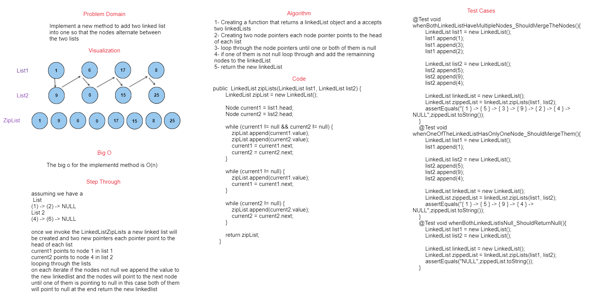

## Challenge

This challenge is to implement a new method called ZipList to merge two linkedlist into one so that the nodes alternate between the two lists

## WhiteBoard



## Approach & Efficiency
initializes a new linked list, zipList, and creates two pointers, current1 and current2, to traverse list1 and list2 respectively. Inside a loop that continues until either list's end is reached, the code appends elements from both lists alternately into zipList, ensuring their interleaved arrangement. After this main loop, two additional loops handle the appending of any remaining elements from list1 and list2 to zipList. The resultant zipList is then returned, effectively merging the input lists while preserving their respective order. 

## Big o
The approach has a linear time complexity, O(n), where n corresponds to the larger of the input lists' lengths.


## Solution

### Code

```java
public  LinkedList zipLists(LinkedList list1, LinkedList list2) {
        LinkedList zipList = new LinkedList();

        Node current1 = list1.head;
        Node current2 = list2.head;

        while (current1 != null && current2 != null) {
            zipList.append(current1.value);
            zipList.append(current2.value);
            current1 = current1.next;
            current2 = current2.next;
        }

        while (current1 != null) {
            zipList.append(current1.value);
            current1 = current1.next;
        }

        while (current2 != null) {
            zipList.append(current2.value);
            current2 = current2.next;
        }

        return zipList;
    }
```

### Test

```java
@Test void whenBothLinkedListHaveMultipleNodes_ShouldMergeTheNodes(){
        LinkedList list1 = new LinkedList();
        list1.append(1);
        list1.append(3);
        list1.append(2);

        LinkedList list2 = new LinkedList();
        list2.append(5);
        list2.append(9);
        list2.append(4);

        LinkedList linkedList = new LinkedList();
        LinkedList zippedList = linkedList.zipLists(list1, list2);
        assertEquals("{ 1 } -> { 5 } -> { 3 } -> { 9 } -> { 2 } -> { 4 } -> NULL",zippedList.toString());
    }
    @Test void whenOneOfTheLinkedListHasOnlyOneNode_ShouldMergeThem(){
        LinkedList list1 = new LinkedList();
        list1.append(1);

        LinkedList list2 = new LinkedList();
        list2.append(5);
        list2.append(9);
        list2.append(4);

        LinkedList linkedList = new LinkedList();
        LinkedList zippedList = linkedList.zipLists(list1, list2);
        assertEquals("{ 1 } -> { 5 } -> { 9 } -> { 4 } -> NULL",zippedList.toString());
    }
    @Test void whenBothLinkedListIsNull_ShouldReturnNull(){
        LinkedList list1 = new LinkedList();
        LinkedList list2 = new LinkedList();

        LinkedList linkedList = new LinkedList();
        LinkedList zippedList = linkedList.zipLists(list1, list2);
        assertEquals("NULL",zippedList.toString());
    }
```
