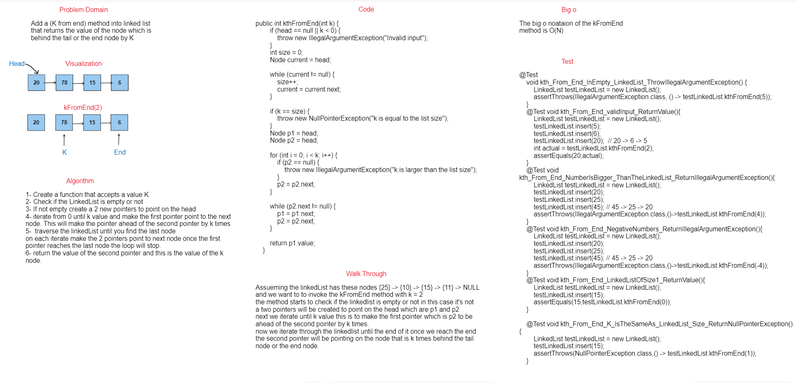

## Summary 

To implement a method `kFromEnd` into linked list that returns the node value which is k behind the end node.

## WhiteBoard


## Approach & Efficiency

The approach used is creating two pointers that points on the head, iterating the first pointer **k** steps in order to be ahead of the second pointer by **k** steps. Then traverse the linkedlist until the end and let the two pointers point to the next once reaching the end of the linked list the second will be pointing on the node that is k steps behind the end node and return it's value.

## Big o

The time complexity of the kth_from_end method is O(n), where n is the length of the linked list. We need to iterate through the linked list twice, once to find its length and once to find the kth node from the end.


## Solution

### Code

```java
public int kthFromEnd(int k) {
        if (head == null || k < 0) {
            throw new IllegalArgumentException("Invalid input");
        }
        int size = 0;
        Node current = head;

        while (current != null) {
            size++;
            current = current.next;
        }

        if (k == size) {
            throw new NullPointerException("k is equal to the list size");
        }
        Node p1 = head;
        Node p2 = head;

        for (int i = 0; i < k; i++) {
            if (p2 == null) {
                throw new IllegalArgumentException("k is larger than the list size");
            }
            p2 = p2.next;
        }

        while (p2.next != null) {
            p1 = p1.next;
            p2 = p2.next;
        }

        return p1.value;
    }
```
Link -> [Code](./app/src/main/java/linkedlist/LinkedList.java)

## Test

```java
@Test
    void kth_From_End_InEmpty_LinkedList_ThrowIllegalArgumentException() {
        LinkedList testLinkedList = new LinkedList();
        assertThrows(IllegalArgumentException.class, () -> testLinkedList.kthFromEnd(5));
    }
    @Test void kth_From_End_validInput_ReturnValue(){
        LinkedList testLinkedList = new LinkedList();
        testLinkedList.insert(5);
        testLinkedList.insert(6);
        testLinkedList.insert(20);  // 20 -> 6 -> 5
        int actual = testLinkedList.kthFromEnd(2);
        assertEquals(20,actual);
    }
    @Test void kth_From_End_NumberIsBigger_ThanTheLinkedList_ReturnIllegalArgumentException(){
        LinkedList testLinkedList = new LinkedList();
        testLinkedList.insert(20);
        testLinkedList.insert(25);
        testLinkedList.insert(45); // 45 -> 25 -> 20
        assertThrows(IllegalArgumentException.class,()->testLinkedList.kthFromEnd(4));
    }
    @Test void kth_From_End_NegativeNumbers_ReturnIllegalArgumentException(){
        LinkedList testLinkedList = new LinkedList();
        testLinkedList.insert(20);
        testLinkedList.insert(25);
        testLinkedList.insert(45); // 45 -> 25 -> 20
        assertThrows(IllegalArgumentException.class,()->testLinkedList.kthFromEnd(-4));
    }
    @Test void kth_From_End_LinkedListOfSize1_ReturnValue(){
        LinkedList testLinkedList = new LinkedList();
        testLinkedList.insert(15);
        assertEquals(15,testLinkedList.kthFromEnd(0));
    }

    @Test void kth_From_End_K_IsTheSameAs_LinkedList_Size_ReturnNullPointerException() {
        LinkedList testLinkedList = new LinkedList();
        testLinkedList.insert(15);
        assertThrows(NullPointerException.class,() -> testLinkedList.kthFromEnd(1));
    }
```

Link -> [Test](./app/src/test/java/linkedlist/LinkedListTest.java)
